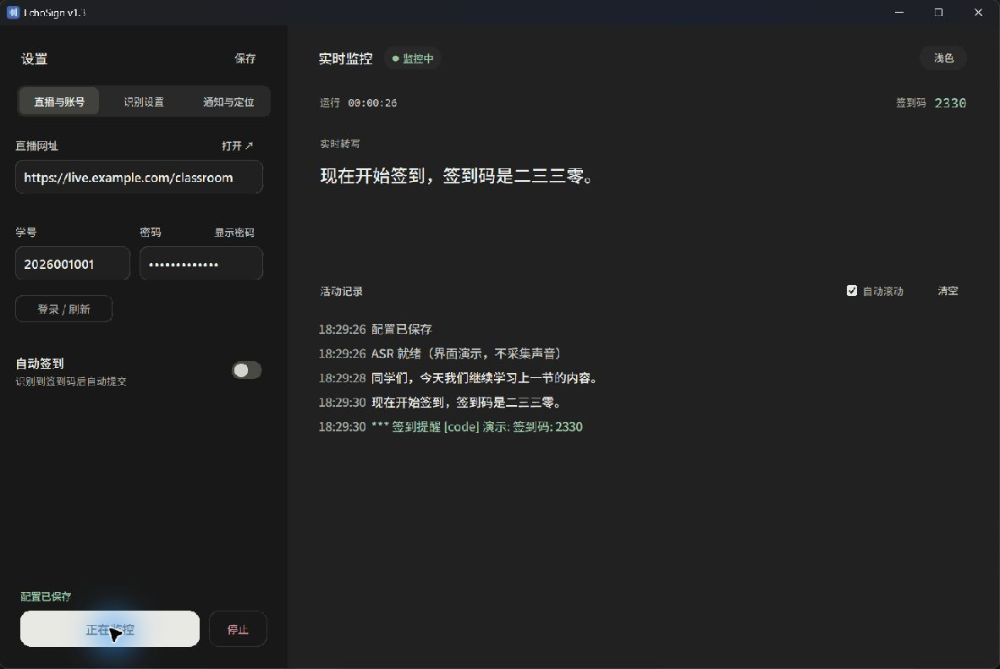
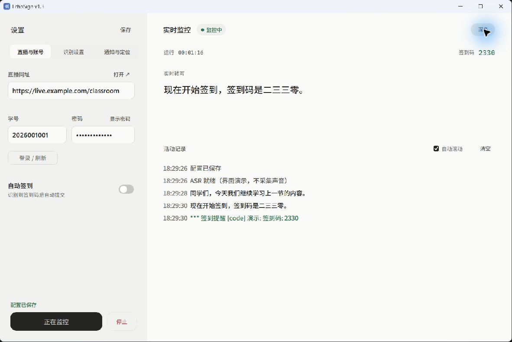

# EchoSign

面向**杭州电子科技大学「上课啦」**（[skl.hdu.edu.cn](https://skl.hdu.edu.cn/index.html)）的 Windows 课堂辅助工具。通过监听本机播放的课堂声音，实时转写中文、识别签到话术与口播的四位签到码，并提供企业微信提醒和可选的浏览器签到操作。

这是个人维护的非官方项目，与杭州电子科技大学及「上课啦」平台不存在官方隶属或合作关系。使用前请阅读下方[免责声明](#免责声明)。

[下载 v1.3 Windows 版](https://github.com/ys317/EchoSign/releases/tag/v1.3) · [所有 Releases](https://github.com/ys317/EchoSign/releases) · [MIT License](LICENSE)

v1.3 更新了桌面界面与中文字体，并修复签到结果误报成功、停止监控后采集线程未退出的问题。

## 界面截图

以下为 v1.3 的真实桌面界面，使用演示账号和模拟转写内容。



<details>
<summary>查看浅色主题</summary>



</details>

## 主要功能

- 使用 Windows WASAPI 环回采集系统输出声音，在本机进行流式中文语音识别。
- 通过关键词、正则、组合词和可选的语义匹配识别签到提示。
- 提取四位签到码，支持「一二三四」「幺二三四」等中文数字。
- 可选企业微信机器人通知，以及面向杭电「上课啦」的浏览器登录和签到操作。
- 双栏桌面界面：简洁侧栏、大字转写、监控状态和活动记录；支持深浅色切换并记住选择，使用 Windows 系统字体。

语音识别和规则匹配可以本地运行；登录、签到、企业微信推送及首次下载浏览器或语义模型需要网络。其他学校或平台的登录与签到流程不在当前适配范围内。

## Releases：exe 使用方法

### 1. 下载并完整解压

适用于 **Windows 10 / 11 x64**。从 [v1.3 Release](https://github.com/ys317/EchoSign/releases/tag/v1.3) 的 **Assets** 下载 `EchoSign-v1.3-win64.zip`。GitHub 自动生成的 `Source code` 压缩包是源码，不包含可直接使用的 exe。

将 ZIP 完整解压到当前用户可写的目录，例如 `D:\Apps\EchoSign`。不要在压缩软件内直接运行，也不要只复制 exe。发行包包含 Python 运行环境和中文语音模型，**不需要另外安装 Python**。

```text
EchoSign/
├── EchoSign.exe
├── _internal/            程序运行库，必须与 exe 放在一起
├── models/               已附带的中文语音识别模型
├── assets/screenshots/   深浅色界面截图
├── install_browser.bat   首次安装浏览器组件
├── LICENSE               MIT 许可证
└── README.md             使用说明
```

Release 同时提供 `SHA256SUMS.txt`。可在 PowerShell 中运行 `Get-FileHash .\EchoSign-v1.3-win64.zip -Algorithm SHA256`，与校验文件中的值比较。

### 2. 首次安装浏览器组件

需要登录或使用自动签到时，先双击解压目录内的 **`install_browser.bat`**，等待提示安装完成。脚本使用发行包自带的 Playwright 驱动，联网下载与本版本匹配的 Chromium，保存到 `%LOCALAPPDATA%\ms-playwright`，通常不需要管理员权限。

已有匹配版本时会复用现有组件；升级 EchoSign 后也可以重新运行一次。下载失败时先查看脚本中的错误信息，确认网络可访问 Playwright 下载服务后重试。

若只使用转写和提醒，可以跳过浏览器安装与登录，并在界面中关闭「自动签到」。

### 3. 配置并登录

双击 **`EchoSign.exe`**，按需填写左侧设置：

| 设置页 | 用途 |
| --- | --- |
| 直播与账号 | 填写课程直播网址；「打开 ↗」在默认浏览器打开页面。需要签到时填写本人的杭电学号和统一身份认证密码，点击「登录 / 刷新」。 |
| 识别设置 | 编辑签到关键词，每行一项，支持 `re:` 正则；按需启用语义辅助识别。 |
| 通知与定位 | 企业微信 Webhook 可留空；填写后可用「测试推送」检查通知。需要签到时请核对经纬度，填写本人真实位置。 |

登录时会打开浏览器。遇到验证码或额外验证，请本人在页面中完成，等待软件日志确认登录成功。登录态保存在本机，失效后再次点击「登录 / 刷新」。**配置中的定位值会作为浏览器报告的位置，不会自动检测你当前的实际位置。**

「保存」或 `Ctrl+S` 可保存配置；点击登录、启动监控时也会保存当前设置。右上角可切换深浅色主题，软件会记住选择。

### 4. 播放课程并启动监控

1. 在浏览器中打开本人有权访问的课堂，完成播放页面所需的登录，并开始播放课程声音。直播网址只是打开页面的快捷入口，软件不会自动替你开始播放。
2. 确认课堂声音从当前默认输出设备播放。软件采集的是系统输出声音，无需对着麦克风播放；其他应用的声音也可能被采集，建议关闭无关音频。
3. 根据课程规定决定是否启用「自动签到」；仅需转写和提醒时关闭它。
4. 点击「启动监控」，等待状态变为「监控中」，确认右侧实时转写随课堂声音更新。命中提示或签到码后，日志会显示相应结果。
5. 结束时点击「停止」。监控期间修改识别或通知设置，需要停止后重新启动才能应用。

发行包已附带中文语音识别模型。可选的「语义辅助识别」首次启用时还需要下载 `BAAI/bge-small-zh-v1.5` 模型，可能较慢；若希望先使用本地规则，可关闭该开关，关键词、正则及签到码识别仍可使用。

### 5. 升级与迁移

先停止监控并关闭旧版，再把新版本解压到一个新目录。按需将自己的 `config.yaml`、`secrets_local.json`、`session_local.json` 和 `browser_profile/` 复制到新目录，保留新版本的 `EchoSign.exe`、`_internal/` 及安装脚本。重新运行 `install_browser.bat`，打开程序检查设置，必要时重新登录。

个人配置、密码和登录态不包含在本仓库的发行附件中；首次使用需要自行配置。请勿将已经使用过的整个软件目录重新打包分享。

## 常见问题

| 情况 | 处理方法 |
| --- | --- |
| 找不到 Python DLL、`_internal` 或其他运行库 | 重新完整解压 Release ZIP，将 exe 与同包的 `_internal` 保持在一起；不要混用不同版本的运行库。 |
| 登录提示 `Executable doesn't exist` 或找不到 Chromium | 运行同一发行包内的 `install_browser.bat`，完成浏览器安装后重试。 |
| 提示模型或 `tokens.txt` 不存在 | 检查 `models/` 是否完整；使用自己的配置时，还需核对 `asr.model_dir` 的相对路径。 |
| 启动时长时间停在模型加载 | 首次语义模型下载需要网络；可先关闭「语义辅助识别」再重启监控。 |
| 没有实时转写 | 确认课程正在播放、输出设备正确且有声音。切换耳机或扬声器后重启监控；可在 `config.yaml` 中用 `device` 指定设备名称关键词。 |
| 未收到企业微信提醒 | 检查完整 Webhook 地址，并使用「测试推送」。默认只推送高优先级提示和签到码，所有命中并不都会推送。 |
| 登录过期、验证码出现或签到结果未知 | 点击「登录 / 刷新」，本人完成验证，并在「上课啦」页面核对最终结果。软件提示不替代平台记录。 |
| 点击保存后失败 | 将整个软件目录放到当前用户可写的位置；不要从 ZIP 内、只读目录或受保护的系统目录运行。 |

## 本地数据与隐私

软件会在 exe 所在目录（源码运行时为项目目录）创建以下文件或目录：

| 文件或目录 | 内容 |
| --- | --- |
| `config.yaml` | 课程链接、规则、定位、主题和企业微信 Webhook 等配置。 |
| `secrets_local.json` | **明文保存**的学号和密码；密码输入框的遮挡不代表文件已加密。 |
| `session_local.json`、`browser_profile/` | 登录会话、Cookie 及浏览器状态，可能用于访问你的账号。 |
| `alerts.jsonl`、`codes.jsonl` | 命中提示和签到码等记录，文件名可在配置中调整。 |

这些内容应按个人敏感数据保管，不要提交到 GitHub、发到群里或附在公开问题反馈中。界面的「清空」只清理当前日志显示，不会删除已写入磁盘的记录。卸载时可关闭软件后删除目录；浏览器组件另存于 `%LOCALAPPDATA%\ms-playwright`，可能与其他 Playwright 程序共用。

语音识别在本机执行。启用企业微信 Webhook 后，命中的文本、签到码及相关结果会发送到你配置的机器人；登录和签到则会与杭电相关服务通信。分享截图或日志前，请遮盖账号、密码、Webhook、会话信息和个人课程数据。

## 从源码运行

建议使用 Windows x64 和 Python 3.13。以下命令在项目根目录的 PowerShell 中执行：

```powershell
python -m venv .venv
.\.venv\Scripts\python.exe -m pip install -r requirements.txt
.\.venv\Scripts\python.exe -m playwright install chromium
```

另行下载 [sherpa-onnx 中文流式模型](https://huggingface.co/csukuangfj/sherpa-onnx-streaming-zipformer-zh-int8-2025-06-30)，放到 `models/sherpa-onnx-streaming-zipformer-zh-int8-2025-06-30/`，确认该目录直接包含 `encoder.int8.onnx`、`decoder.onnx`、`joiner.int8.onnx` 和 `tokens.txt`。也可从本项目 Release 中复制 `models/`。

```powershell
.\.venv\Scripts\python.exe echosign_app.py
```

首次打开会读取 `config.example.yaml` 作为模板，在界面保存后生成个人配置。需要使用命令行时，先通过 GUI 保存配置，或在尚无 `config.yaml` 时复制模板再编辑。

| 命令（在前面加 `.\.venv\Scripts\python.exe`） | 用途 |
| --- | --- |
| `main.py devices` | 列出可用输出设备。 |
| `main.py run` | 启动声音监控。 |
| `main.py code` | 用内置示例检查签到码提取。 |
| `main.py demo` | 用示例文本检查规则匹配。 |
| `main.py webhook-test` | 向已配置的企业微信机器人实际发送测试消息。 |
| `browser_login.py` | 打开浏览器进行登录并保存会话。 |

### 本地打包与验证

```powershell
.\.venv\Scripts\python.exe -m pip install pyinstaller==6.22.2 pillow==12.2.0
.\.venv\Scripts\python.exe -m unittest discover -s tests -p test_gui.py -v
.\.venv\Scripts\python.exe -m unittest discover -s tests -p test_reliability.py -v
.\build_exe.ps1
```

构建先在 `build/ui-dist/EchoSign` 暂存，再更新 `dist/EchoSign` 中的程序、运行库和说明，保留已有个人配置。更新发行目录前请关闭其中正在运行的程序。需要只生成暂存构建时，使用 `./build_exe.ps1 -StageOnly`。

本地打包脚本不复制语音模型，运行监控前还需放好 `models/`；GitHub Release ZIP 则已包含该模型。上述 GUI 与可靠性回归测试使用临时配置、模拟浏览器响应和模拟音频设备，覆盖签到结果判定、停止采集、异常退出及界面交互，不会实际登录、签到或发送远程通知。`tests/` 中其他脚本包含实机调试用途，运行前请先阅读脚本。

核心代码位于 `automonitor/`；`echosign_app.py` 为桌面入口，`main.py` 为命令行入口，`browser_login.py` 和 `browser_sign.py` 负责平台浏览器操作。

## 许可证

本项目原创代码采用 [MIT License](LICENSE)，允许使用、修改和分发（包括商业用途），需保留版权声明和许可证文本。第三方运行库与模型遵循各自的许可证及使用条件。

## 免责声明

1. **非官方项目。** 本项目主要为杭州电子科技大学「上课啦」的个人课堂辅助场景准备，不代表学校、平台或任课教师，也未获其官方背书。
2. **仅限有权访问的课程和本人账号。** 使用者应遵守法律法规、学校教学管理要求及平台规则。自动签到仅应在学校和任课教师允许的范围内使用；不允许时请关闭该功能，仅使用合规的转写或提醒功能。
3. **不得替代实际出勤。** 不得用于代签、伪造位置或出勤记录、绕过身份验证、干扰教学秩序及其他未经授权的操作。软件不提供规避考勤要求的授权。
4. **识别和操作均可能失败。** 音频质量、网络延迟、识别误差、登录过期、验证码及平台更新都可能造成误报、漏报或签到失败。请自行关注课堂并在平台核实结果，不要把课程出勤完全交给软件。
5. **按现状提供。** 在适用法律允许的范围内，项目不承诺准确性、连续可用性或对特定用途的适用性；使用者应自行保护账号与数据，并承担其使用行为产生的责任。
